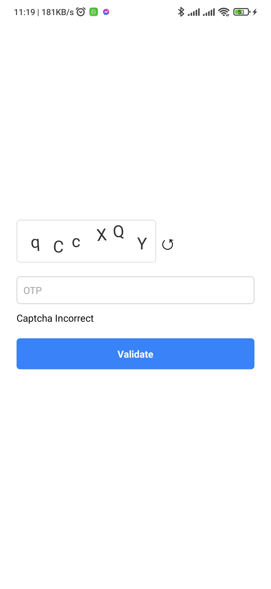

# react-native-simple-text-captcha

Create and validate text captcha in React Native app

## Installation

```sh
npm install react-native-simple-text-captcha
yarn add react-native-simple-text-captcha
```

## Screenshots

<div style="display:flex;">
  
  
</div>

## Usage

###### Import

```jsx
import type { CaptchaRef } from 'react-native-simple-text-captcha';
import Captcha from 'react-native-simple-text-captcha';
```

###### State and Ref

```js
const captchaRef = useRef < CaptchaRef > null;

const [captcha, setCaptcha] = useState('');
const [validateResult, setValidateResult] = useState('');
```

###### Validation logic

```jsx
const validateCaptcha = () => {
  const check = captchaRef.current?.validateCaptcha(captcha);
  if (check) {
    setValidateResult('Captcha Corrected');
  } else {
    setValidateResult('Captcha Incorrect');
  }
};
```

###### Component

```jsx
<Captcha ref={captchaRef} />

<TextInput
  style={styles.input}
  value={captcha}
  onChangeText={setCaptcha}
  cursorColor={'#333'}
  placeholder="OTP"
/>

<Text>{validateResult}</Text>

<TouchableOpacity style={styles.button} onPress={validateCaptcha}>
  <Text style={styles.buttonText}>Validate</Text>
</TouchableOpacity>

```

## Props

| Name                | Type      | Default |
| ------------------- | --------- | ------- |
| captchaLength       | number    | 6       |
| background          | string    | white   |
| textColor           | string    | black   |
| refreshIcon         | ReactNode | ↺       |
| captchaWrapperStyle | ViewStyle | none    |

## Contributing

See the [contributing guide](CONTRIBUTING.md) to learn how to contribute to the repository and the development workflow.

## License

MIT

---

Made with [create-react-native-library](https://github.com/callstack/react-native-builder-bob)

```

```
